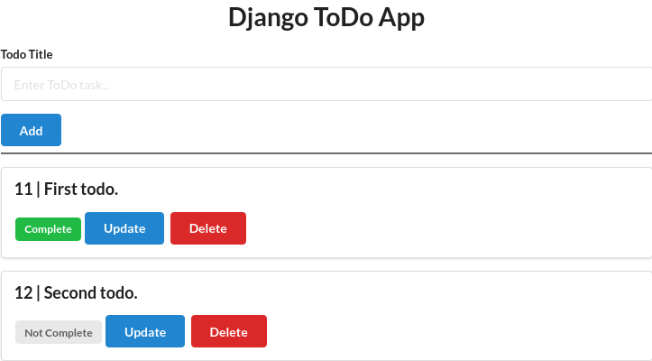

## Todo App - Django
<br />
<p align="center">

<br />
A simple todo app built with django
</p>
<br />
<br />
## Setup

To get this repository, run the following commands inside your terminal

```bash
$ git clone https://github.com/emrekndl/todoAppDjango.git
```

```bash
$ python manage.py makemigrations
```

```bash
$ python manage.py migrate
```

```bash
$ python manage.py createsuperuser
```

```bash
$ python manage.py runserver
```
